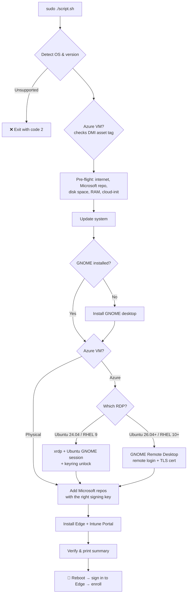

<div align="center">

```
██╗     ██╗███╗   ██╗██╗   ██╗██╗  ██╗    ██╗███╗   ██╗████████╗██╗   ██╗███╗   ██╗███████╗
██║     ██║████╗  ██║██║   ██║╚██╗██╔╝    ██║████╗  ██║╚══██╔══╝██║   ██║████╗  ██║██╔════╝
██║     ██║██╔██╗ ██║██║   ██║ ╚███╔╝     ██║██╔██╗ ██║   ██║   ██║   ██║██╔██╗ ██║█████╗
██║     ██║██║╚██╗██║██║   ██║ ██╔██╗     ██║██║╚██╗██║   ██║   ██║   ██║██║╚██╗██║██╔══╝
███████╗██║██║ ╚████║╚██████╔╝██╔╝ ██╗    ██║██║ ╚████║   ██║   ╚██████╔╝██║ ╚████║███████╗
╚══════╝╚═╝╚═╝  ╚═══╝ ╚═════╝ ╚═╝  ╚═╝   ╚═╝╚═╝  ╚═══╝   ╚═╝    ╚═════╝ ╚═╝  ╚═══╝╚══════╝

███████╗███╗   ██╗██████╗  ██████╗ ██╗     ██╗     ███╗   ███╗███████╗███╗   ██╗████████╗
██╔════╝████╗  ██║██╔══██╗██╔═══██╗██║     ██║     ████╗ ████║██╔════╝████╗  ██║╚══██╔══╝
█████╗  ██╔██╗ ██║██████╔╝██║   ██║██║     ██║     ██╔████╔██║█████╗  ██╔██╗ ██║   ██║
██╔══╝  ██║╚██╗██║██╔══██╗██║   ██║██║     ██║     ██║╚██╔╝██║██╔══╝  ██║╚██╗██║   ██║
███████╗██║ ╚████║██║  ██║╚██████╔╝███████╗███████╗██║ ╚═╝ ██║███████╗██║ ╚████║   ██║
╚══════╝╚═╝  ╚═══╝╚═╝  ╚═╝ ╚═════╝ ╚══════╝╚══════╝╚═╝     ╚═╝╚══════╝╚═╝  ╚═══╝   ╚═╝

███████╗ ██████╗██████╗ ██╗██████╗ ████████╗███████╗    ██╗   ██╗██████╗ 
██╔════╝██╔════╝██╔══██╗██║██╔══██╗╚══██╔══╝██╔════╝    ██║   ██║╚════██╗
███████╗██║     ██████╔╝██║██████╔╝   ██║   ███████╗    ██║   ██║ █████╔╝
╚════██║██║     ██╔══██╗██║██╔═══╝    ██║   ╚════██║    ╚██╗ ██╔╝██╔═══╝ 
███████║╚██████╗██║  ██║██║██║        ██║   ███████║     ╚████╔╝ ███████╗
╚══════╝ ╚═════╝╚═╝  ╚═╝╚═╝╚═╝        ╚═╝   ╚══════╝      ╚═══╝  ╚══════╝
```

### One script per distro. Azure VM or physical desktop. Detected automatically.
#### Automated Bash prep for enrolling Linux machines into Microsoft Intune — v3.0


</div>

> [!NOTE]
> 🚧 **Work in progress.** I'm still testing and improving the new v3 scripts for each distro and hope to have the final versions up soon. The legacy scripts are kept in the repo, unchanged, for older systems.

> [!IMPORTANT]
> **Sign in to Microsoft Edge _before_ opening the Intune app.** Skipping the Edge sign-in causes enrollment error **`4ulu5`**.

---

## 📋 Table of Contents

- [Quick Start](#-quick-start)
- [Which Script Do I Use?](#-which-script-do-i-use)
- [How It Works](#-how-it-works)
- [What's New in v3](#-whats-new-in-v3)
- [The v3 Scripts](#-the-v3-scripts)
- [Options & Exit Codes](#-options--exit-codes)
- [Azure VM Guide](#-azure-vm-guide)
- [After the Script: Enrolling](#-after-the-script-enrolling)
- [Legacy Scripts](#-legacy-scripts)
- [Troubleshooting](#-troubleshooting)
- [Under the Hood: Research Notes](#-under-the-hood-research-notes)
- [Roadmap](#-roadmap)
- [References](#-references)
- [Author](#-author)

---

## ⚡ Quick Start

```bash
# 1. Clone the repo
git clone https://github.com/NeptuneCipher42/Linux-Intune-Enrollment-Scripts-Version-2.git
cd Linux-Intune-Enrollment-Scripts-Version-2

# 2. Pick your distro's script and make it executable
chmod +x Ubtuntun-26.04-LTS-Intune-Enrollment.sh      # Ubuntu 24.04 / 26.04
chmod +x RHEL-9-RHEL-10-Intune-Enrollment.sh          # RHEL 9 / 10

# 3. Preview what it will do (changes nothing)
sudo ./Ubtuntun-26.04-LTS-Intune-Enrollment.sh --dry-run

# 4. Run it for real
sudo ./Ubtuntun-26.04-LTS-Intune-Enrollment.sh
```

> [!TIP]
> Run with `sudo` from **your normal user account**, not as root. The scripts configure the desktop session for whoever ran `sudo`.

---

## 🧭 Which Script Do I Use?

| Your system | Azure VM | Physical desktop | Script |
|---|:---:|:---:|---|
| **Ubuntu 26.04 LTS** | ✅ | ✅ | `Ubtuntun-26.04-LTS-Intune-Enrollment.sh` |
| **Ubuntu 24.04 LTS** | ✅ | ✅ | `Ubtuntun-26.04-LTS-Intune-Enrollment.sh` |
| **RHEL 10** | ✅ | ✅ | `RHEL-9-RHEL-10-Intune-Enrollment.sh` |
| **RHEL 9** | ✅ | ✅ | `RHEL-9-RHEL-10-Intune-Enrollment.sh` |
| Ubuntu 22.04 LTS *(legacy)* | ✅ | ✅ | `Ubuntu-LTS-Enrollment-Azure-VM-22.04-24.sh` / `Ubuntu-LTS-Physical-Desktop-Enrollment-22.04-24..sh` |
| RHEL 8 *(legacy)* | ✅ | ✅ | `RHEL-8-Enrollment-Azure-VM.sh` / `RHEL-8-Physical-Desktop-Enrollment.sh` |
| Future LTS releases | ✅ | ✅ | v3 scripts — allowed automatically once Microsoft publishes a repo for them |

Microsoft currently supports **Ubuntu Desktop 24.04 / 26.04 LTS** and **RHEL 9 / 10** on **x86_64** (physical, Azure VM or Hyper-V), with a **GNOME** desktop. Ubuntu 22.04 and RHEL 8 have been dropped from the official list, so the v3 scripts block them unless you pass `--force`.

---

## 🧠 How It Works

The v3 scripts look at the machine first, then decide what to do:



Everything is **idempotent**: re-running the script skips whatever is already done.

---

## ✨ What's New in v3

| | v2 | **v3** |
|---|---|---|
| Scripts to maintain | 4 (distro × VM/physical) | **2** — one per distro, auto-detects Azure vs physical |
| Supported versions | Ubuntu 22.04, RHEL 8/9 | **Ubuntu 24.04/26.04, RHEL 9/10**, plus future releases |
| Version handling | Hardcoded (`jammy`, `rhel9.0`) | **Detected** from `/etc/os-release`, checked against Microsoft's repo |
| Remote desktop | xrdp everywhere | **xrdp or GNOME Remote Desktop**, chosen per version |
| Signing keys | One key | **Correct key per release** (`microsoft-2025` for Ubuntu 26.04+/RHEL 10+) |
| GNOME detection | `$XDG_CURRENT_DESKTOP` (empty over SSH) | **Installed packages** (works over SSH and sudo) |
| Reboots | Mid-script reboot, then re-run | **Single run**, one reboot at the end |
| Session files | Written to root's home under `sudo` | Written to **your user** and `/etc/skel` |
| Error handling | None | **11 exit codes**, full log, verification step |
| Azure extras | — | cloud-init wait, keyring unlock, RHUI/CRB lookup, password check |
| Safety | — | `--dry-run`, pre-flight checks, cleanup of conflicting repo files |

---

## 📦 The v3 Scripts

<details open>
<summary><b>🟠 Ubtuntun-26.04-LTS-Intune-Enrollment.sh — Ubuntu 24.04 / 26.04</b></summary>

<br>

**Targets:** Ubuntu 24.04 LTS and 26.04 LTS (x86_64), Azure VM or physical desktop

**What it does:**
1. Detects the release, architecture and whether it's an Azure VM
2. Pre-flight: Microsoft repo exists for this release, disk space, RAM, waits for cloud-init
3. Full system update
4. Installs `ubuntu-desktop-minimal` if GNOME isn't present
5. **Azure VMs:** sets up RDP
   - **24.04 →** xrdp + xorgxrdp, Flashback fallback session, `ssl-cert` group, `.xsession` + `.xsessionrc` forcing the `ubuntu:GNOME` session (dock & taskbar), GNOME keyring unlock at RDP login
   - **26.04+ →** GNOME Remote Desktop "remote login" with a self-signed TLS cert
   - Opens 3389/tcp in **UFW** if it's active
6. Adds the Microsoft Intune + Edge repos with the correct key per release
7. Installs **Microsoft Edge** and the **Intune Portal** (or updates them if already present)
8. Verifies, prints a summary, reboots

</details>

<details open>
<summary><b>🔴 RHEL-9-RHEL-10-Intune-Enrollment.sh — RHEL 9 / 10</b></summary>

<br>

**Targets:** RHEL 9 and 10 (and AlmaLinux 9/10), x86_64, Azure VM or physical desktop

**What it does:**
1. Detects the major version, architecture and whether it's an Azure VM
2. Pre-flight: Microsoft repo exists, BaseOS repo enabled (subscription or Azure RHUI), disk, RAM, cloud-init
3. Full system update
4. Enables **CodeReady Builder** (finds the right repo ID for subscription, Azure RHUI or AlmaLinux) and installs **EPEL**
5. Installs **Server with GUI** if GNOME isn't present, sets the graphical target
6. **Azure VMs:** sets up RDP
   - **RHEL 9 →** xrdp from EPEL, GNOME via `~/.Xclients`, SELinux context fix, keyring unlock
   - **RHEL 10+ →** GNOME Remote Desktop "remote login" with a self-signed TLS cert
   - Opens 3389/tcp in **firewalld**
7. Adds the Microsoft Intune + Edge repos with the correct key per release, removes stale repo files from older installers
8. Installs **Microsoft Edge** and the **Intune Portal**, verifies, reboots

</details>

---

## 🧰 Options & Exit Codes

<table>
<tr><td valign="top">

**Options** (both v3 scripts)

| Flag | What it does |
|---|---|
| `--dry-run` | Show every action without changing anything |
| `--no-reboot` | Skip the reboot at the end |
| `--remote` | Set up RDP even if not on Azure (e.g. Hyper-V) |
| `--no-remote` | Skip RDP even on an Azure VM |
| `--rdp-backend xrdp\|grd` | Force the RDP method |
| `--skip-desktop` | Don't install a desktop |
| `--force` | Allow releases Microsoft no longer lists |
| `-h`, `--help` | Show help |

**Environment variables** (GNOME Remote Desktop, unattended runs)

| Variable | Use |
|---|---|
| `RDP_USER` | RDP gateway username |
| `RDP_PASSWORD` | RDP gateway password |

</td><td valign="top">

**Exit codes**

| Code | Meaning |
|:---:|---|
| `0` | Success |
| `1` | Not root / bad arguments |
| `2` | Unsupported OS, release or arch |
| `3` | Can't reach Microsoft / EPEL |
| `4` | Pre-flight failed (disk, lock) |
| `5` | Update / prerequisites failed |
| `6` | Desktop install failed |
| `7` | Remote desktop setup failed |
| `8` | Microsoft key / repo failed |
| `9` | Edge install failed |
| `10` | Intune Portal install failed |
| `11` | Final verification failed |

</td></tr>
</table>

📄 Full log: **`/var/log/intune-enrollment-prep.log`**

---

## 🔷 Azure VM Guide

Azure images are **server** images: no desktop, no display manager, no keyring, and usually an SSH-key-only user. The v3 scripts handle that, but a few things are on you:

<details>
<summary><b>1. Create the VM</b></summary>

<br>

| Setting | Recommendation |
|---|---|
| Image | Ubuntu Server 24.04 LTS / 26.04 LTS (x64 Gen2), or RHEL 9 / 10 |
| Size | **4 GB+ RAM** (e.g. `Standard_B2s` minimum, `Standard_D2s_v3` recommended) |
| Disk | 30 GB+ OS disk (the desktop install is several GB) |
| Public IP | None if you use Bastion (recommended) |

</details>

<details>
<summary><b>2. Give your user a password</b></summary>

<br>

RDP and the GNOME login need one, and SSH-key users don't have one by default:

```bash
sudo passwd <your-user>
```

The script warns you at the end if this is missing.

</details>

<details>
<summary><b>3. Allow RDP in</b></summary>

<br>

Either:
- **Azure Bastion (recommended):** must be the **Standard** SKU to RDP into Linux VMs, or
- **NSG rule:** allow inbound TCP **3389**, ideally only from your IP

The scripts open 3389 in the VM's own firewall (UFW / firewalld) automatically.

</details>

<details>
<summary><b>4. Connecting on Ubuntu 26.04 / RHEL 10 (GNOME Remote Desktop)</b></summary>

<br>

GNOME Remote Desktop uses **two** logins:
1. The **RDP gateway** login you set when the script prompted (or via `RDP_USER` / `RDP_PASSWORD`)
2. The normal **GNOME login screen**, where you sign in with your Linux account

Change the gateway login any time with:

```bash
sudo grdctl --system rdp set-credentials
```

</details>

---

## ✅ After the Script: Enrolling

1. 🔄 Let the machine reboot, then sign in to the desktop (over RDP on Azure)
2. 🌐 Open **Microsoft Edge** and sign in with your **work account** — *do this first*
3. 📲 Open the **Microsoft Intune** app and follow the prompts
4. 🔍 Confirm the device shows up in the [Intune admin center](https://intune.microsoft.com)

> [!TIP]
> Intune compliance policies often require **disk encryption**. On physical machines, enable it when installing the OS — Microsoft notes it's hard to add afterwards.

---

## 📁 Legacy Scripts

These are the original v1/v2 scripts, kept **as-is** for older systems. They still work for many setups, but they don't have v3's detection, error handling or one-run flow. **Use v3 wherever you can.**

<details>
<summary><b>🟠 Ubuntu-LTS-Enrollment-Azure-VM-22.04-24.sh — Ubuntu 22.04 Azure VM</b></summary>

<br>

- Full update, then GNOME minimal + Flashback + metacity + xrdp + xorgxrdp
- Adds xrdp to `ssl-cert`, sets `.xsession` to `gnome-session` for the dock and taskbar
- Optional `.xsessionrc` block (commented out) if the taskbar doesn't load
- Installs Edge and the Intune Portal from the **22.04 (jammy)** repo, then reboots

</details>

<details>
<summary><b>🟠 Ubuntu-LTS-Physical-Desktop-Enrollment-22.04-24..sh — Ubuntu 22.04</b></summary>

<br>

- Checks for GNOME, installs GNOME + xrdp with the `.xsession` / `.xsessionrc` session fix if missing
- Reboots, then (re-run) installs prerequisites, Edge and the Intune Portal from the **22.04 (jammy)** repo

</details>

<details>
<summary><b>🔴 RHEL-8-Enrollment-Azure-VM.sh — RHEL 8 Azure VM</b></summary>

<br>

- Installs EPEL, xrdp and tigervnc-server, opens 3389 in firewalld
- Adds the Microsoft Edge and Intune (`microsoft-rhel9.0-prod`) repos, installs Edge and the Intune Portal, reboots

</details>

<details>
<summary><b>🔴 RHEL-8-Physical-Desktop-Enrollment.sh — RHEL 8 Physical</b></summary>

<br>

- Installs **Server with GUI** if GNOME isn't detected, sets the graphical target, reboots
- Then (re-run) adds the Microsoft repos and installs Edge and the Intune Portal

</details>

> [!WARNING]
> Ubuntu 22.04 and RHEL 8 are **no longer on Microsoft's Intune supported list**. Enrollment may still work, but plan an upgrade.

---

## 🩺 Troubleshooting

<details>
<summary><b>❌ Enrollment error <code>4ulu5</code></b></summary>

<br>

Edge wasn't signed in first. Open Microsoft Edge, sign in with your work account, finish Edge setup, then reopen the Intune app.

</details>

<details>
<summary><b>🖥️ Blank or blue screen over RDP on Ubuntu 26.04 / RHEL 10</b></summary>

<br>

xrdp is being used where it can't work: GNOME no longer has an X11 session on these releases. Re-run the v3 script without `--rdp-backend xrdp`; it will remove xrdp and set up GNOME Remote Desktop instead.

</details>

<details>
<summary><b>🧩 Dock or taskbar missing over xrdp (Ubuntu 24.04 / 22.04)</b></summary>

<br>

The session isn't loading Ubuntu's GNOME mode. v3 writes this automatically; for legacy scripts, add it manually and reconnect:

```bash
echo "gnome-session" > ~/.xsession
cat > ~/.xsessionrc << "EOF"
export XAUTHORITY=${HOME}/.Xauthority
export GNOME_SHELL_SESSION_MODE=ubuntu
export XDG_CURRENT_DESKTOP=ubuntu:GNOME
export XDG_CONFIG_DIRS=/etc/xdg/xdg-ubuntu:/etc/xdg
EOF
```

</details>

<details>
<summary><b>🔑 Intune sign-in never shows a password prompt (xrdp)</b></summary>

<br>

The GNOME keyring isn't unlocking at RDP login. v3 adds the fix to `/etc/pam.d/xrdp-sesman`; on legacy setups, add these lines (from Microsoft's own Azure VM guide):

```
auth    optional        pam_gnome_keyring.so
session optional        pam_gnome_keyring.so auto_start
```

</details>

<details>
<summary><b>🔐 <code>NO_PUBKEY</code> or "conflicting values for Signed-By"</b></summary>

<br>

Usually leftover repo files from older scripts, or the wrong key for your release. v3 cleans these up automatically. Manually:

```bash
sudo rm -f /etc/apt/sources.list.d/microsoft-edge-dev.list \
           /etc/apt/sources.list.d/microsoft-ubuntu-*-prod.list \
           /etc/apt/trusted.gpg.d/microsoft.gpg
```

Then re-run the v3 script. On **Ubuntu 26.04+ / RHEL 10+**, the Intune repo needs the newer `microsoft-2025` key, while Edge still uses the original `microsoft.asc`.

</details>

<details>
<summary><b>⏳ "Could not get lock /var/lib/dpkg/lock" on a new Azure VM</b></summary>

<br>

cloud-init is still installing updates on first boot. v3 waits for it automatically; otherwise run `cloud-init status --wait` and try again.

</details>

<details>
<summary><b>📦 Intune Portal fails to install on RHEL 10</b></summary>

<br>

It needs `webkitgtk6.0` from **EPEL**, which needs **CodeReady Builder**. v3 enables both. Check with `dnf repolist` that EPEL and a `codeready`/`crb` repo are enabled.

</details>

<details>
<summary><b>📄 Where are the logs?</b></summary>

<br>

- Script log: `/var/log/intune-enrollment-prep.log`
- xrdp: `/var/log/xrdp.log`, `/var/log/xrdp-sesman.log`
- GNOME Remote Desktop: `journalctl -u gnome-remote-desktop`

</details>

---

## 🔬 Under the Hood: Research Notes

<details>
<summary><b>Why xrdp stops working on Ubuntu 26.04 and RHEL 10</b></summary>

<br>

xrdp runs desktops on an **X11 (Xorg)** server. GNOME 49 removed GNOME's X11 session and GNOME 50 (Ubuntu 26.04) deleted it entirely; RHEL 10 dropped the Xorg server too. With no X11 session, xrdp can't start GNOME and you get a blank screen. The replacement is **GNOME Remote Desktop**, GNOME's built-in RDP server, whose "remote login" mode runs through the GDM login screen and works on headless VMs. v3 switches automatically based on version.

</details>

<details>
<summary><b>Why there are two Microsoft signing keys</b></summary>

<br>

Microsoft signs its package repos for **Ubuntu 26.04+** and **RHEL 10+** with a newer key (`microsoft-2025.asc`). The **Edge** repo is still signed with the original `microsoft.asc` on every release. Using one key for both breaks one of the two repos, which is exactly the bug Microsoft fixed in its own installer in May 2026. v3 imports both and points each repo at the right one.

</details>

<details>
<summary><b>How Azure VMs are detected</b></summary>

<br>

Every Azure VM reports the same chassis asset tag (`7783-7084-3265-9085-8269-3286-77`) in `/sys/class/dmi/id/chassis_asset_tag`. If it matches, the script treats the machine as an Azure VM and sets up RDP. Override with `--remote` / `--no-remote`.

</details>

<details>
<summary><b>How "future versions" work</b></summary>

<br>

Instead of a hardcoded list, v3 reads the version from `/etc/os-release` and checks whether Microsoft has published an Intune repo for it. When Ubuntu or RHEL ship a new release and Microsoft adds a repo, the script works without edits. Until then, it stops with a clear message instead of half-installing.

</details>

---

## 🚀 Roadmap

- [x] Merge VM and physical scripts into one per distro
- [x] Ubuntu 26.04 and RHEL 10 support (GNOME Remote Desktop, new signing key)
- [x] Version detection, pre-flight checks, exit codes, logging, `--dry-run`
- [ ] Full end-to-end testing on fresh Azure VMs and physical hardware for every release
- [ ] Final release of the v3 scripts
- [ ] Rename `Ubtuntun-26.04-LTS-Intune-Enrollment.sh` → `Ubuntu-Intune-Enrollment.sh`
- [ ] Optional disk-encryption readiness check for Intune compliance

---

## 📚 References

- [Get the Microsoft Intune app for Linux](https://learn.microsoft.com/en-us/intune/user-help/company-portal/intune-app-linux) — supported versions
- [Enroll a Linux device in Intune](https://learn.microsoft.com/mem/intune/user-help/enroll-device-linux) — requirements, Azure VM support
- [Linux enrollment guide for admins](https://learn.microsoft.com/intune/device-enrollment/guide-linux)
- [Microsoft's shell-intune-samples](https://github.com/microsoft/shell-intune-samples) — official installer and Azure VM guide
- [Red Hat: Administering RHEL 10 with GNOME](https://docs.redhat.com/en/documentation/red_hat_enterprise_linux/10/html-single/administering_rhel_by_using_the_gnome_desktop_environment/index) — GNOME Remote Desktop remote login
- [Ubuntu 26.04 and xrdp (c-nergy.be)](https://c-nergy.be/blog/?p=20378)

---

<div align="center">

## 👤 Author

**Nicholas Fisher**

[](https://github.com/NeptuneCipher42)

<sub>These scripts are provided as-is. Test in a non-production environment before rolling out. Not affiliated with or supported by Microsoft or Red Hat.</sub>

</div>
